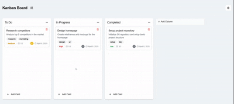

# Next.js Kanban Board

A modern, responsive Kanban board application built with Next.js, TypeScript, and Tailwind CSS.

<div align="center">
    
</div>
<div align="center">
    
</div>

## Features

- 📱 Mobile friendly design
- 🎯 Drag and drop functionality(with dnd-kit)
- 📝 Rich card management
  - Title and description
  - Assignees
  - Tags
  - Priority levels
  - Checklists
  - Due dates
  - Image attachments
- 🏗️ Column management
  - Create, rename, and delete columns
  - Drag and drop cards between columns
- 🎨 Customizable board appearance
  - Background colors
  - Background images
- 🔄 Real-time updates

## Tech Stack

- [Next.js](https://nextjs.org/) - React framework
- [TypeScript](https://www.typescriptlang.org/) - Type safety
- [Tailwind CSS](https://tailwindcss.com/) - Styling
- [shadcn/ui](https://ui.shadcn.com/) - UI components
- [@dnd-kit](https://dnd-kit.com/) - Drag and drop functionality
- [Lucide Icons](https://lucide.dev/) - Icons

## Project Detail

Refer [project](./docs/project.md)

## Getting Started

### Prerequisites

- Node.js 20+ and pnpm 10+

### Installation

1. Clone the repository:
```bash
git clone https://github.com/jjteoh-thewebdev/next-kanban.git
cd next-kanban
```

2. Install dependencies:
```bash
pnpm install
```

3. Run the development server:
```bash
pnpm run dev
```

4. Open [http://localhost:3000](http://localhost:3000) in your browser.


## License

This project is licensed under the MIT License - see the [LICENSE](LICENSE) file for details. 

## Credit

This project is bootstrapped from [Vercel](https://vercel.com/)
